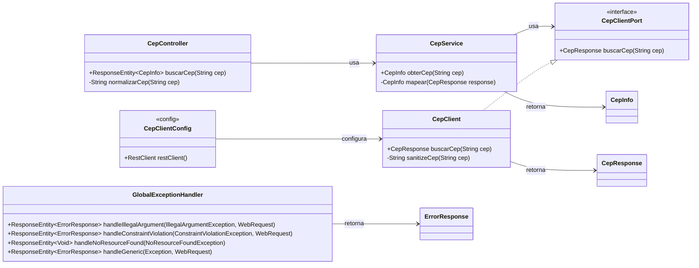
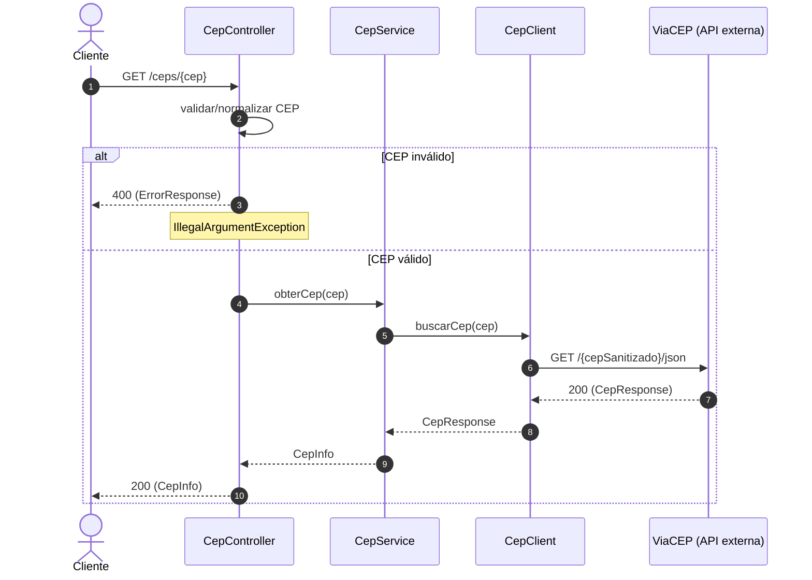

# Demo - Serviço de CEP (Java + Spring Boot)

Este repositório é uma prova de conceito (POC) em Java com Spring Boot que expõe uma API REST simples para buscar informações de um CEP (endereço brasileiro). O projeto contém um `controller`, `service` e um `client` que consome uma API externa (ex.: ViaCEP), além de DTOs para modelagem.

> Nota: este projeto foi realizado para estudar na prática como funciona a funcionalidade de **agente do GitHub Copilot no IntelliJ IDEA**.

SUMÁRIO
- Visão Geral
- Arquitetura e responsabilidades
- Endpoints
- DTOs e mapeamento
- Diagramas (Mermaid)
- Testes e cobertura
- Boas práticas aplicadas (SOLID, DRY)
- Melhorias sugeridas e padrões de projeto
- Como rodar, testar e gerar site com Maven
- Instruções para CI e cobertura

---

## Visão Geral
O serviço oferece um endpoint HTTP REST para consulta de CEPs. O fluxo principal é:
1. Requisição HTTP GET para `/ceps/{cep}`
2. `CepController` valida o formato do CEP
3. `CepService` delega para `CepClient` buscar os dados na API externa
4. `CepClient` realiza o HTTP call e desserializa a resposta para `CepResponse`
5. `CepService` mapeia `CepResponse` para `CepInfo` e retorna ao cliente

Tecnologias principais:
- Java 25
- Spring Boot 4
- JUnit 5 + Mockito
- Maven (via Maven Wrapper do projeto)


## Arquitetura e responsabilidades
- `CepController` (camada web): valida entrada e expõe o endpoint.
- `CepService` (camada de domínio): orquestra a chamada ao cliente e mapeia resposta para DTOs usados pela API.
- `CepClient` (camada de integração/cliente HTTP): realiza chamadas HTTP para a API externa.
- `CepResponse`, `CepInfo` (DTOs): modelos para receber e retornar dados.

Observação: a organização atual é simples e adequada para POC. Para aplicações maiores, vale seguir uma separação mais rígida por camadas e contratos (interfaces), mas aqui a ideia é manter o projeto direto e fácil de entender.


## Endpoints
GET /ceps/{cep}
- Parâmetros: `cep` no path (padrão `99999-999` ou `99999999`)
- Retorno: `200 OK` com JSON contendo `cep`, `logradouro`, `complemento`, `bairro`, `cidade` e `estado`.

Exemplo:
GET /ceps/04842-010
Resposta (200):
{
  "cep":"04842-010",
  "logradouro":"Rua Exemplo",
  "complemento":"",
  "bairro":"Bairro",
  "cidade":"São Paulo",
  "estado":"SP"
}


## DTOs
- `CepResponse` — mapeia diretamente a resposta JSON da API externa (anotado com Jackson).
- `CepInfo` — DTO público retornado pela API do serviço (conteúdo reduzido do `CepResponse`).


## Diagramas (Mermaid)

### Diagrama de classes


### Diagrama de sequência (GET /ceps/{cep})



## Testes e cobertura
O projeto possui testes unitários para `CepClient`, `CepService` e `CepController`, além de um teste de integração.

Dicas para garantir e aumentar cobertura:
- Adicionar testes de erro no `CepClient` (timeout, 404, corpo inválido).
- Testar o mapeamento nulo/valores ausentes em `CepService#mapear`.
- Adicionar testes para as validações do controller (CEP inválido) usando MockMvc.


## Boas práticas aplicadas (SOLID, DRY)
- Single Responsibility: cada classe tem responsabilidade única (controller, service, client, dto).
- Dependency Inversion: onde faz sentido, usar interfaces (ex.: `CepClientPort`) para reduzir acoplamento.
- DRY: evitar duplicação de regras (ex.: normalização/validação do CEP).


## Possíveis padrões de projeto aplicáveis
- Adapter (para adaptar o cliente HTTP a uma interface)
- Strategy (para trocar provedores de CEP, caso existam)


## Melhorias e ações recomendadas
- Externalizar configurações (base URL, timeout) para `application.properties` ou `application.yml`.
- Tratar exceções do client e retornar respostas apropriadas com `@ControllerAdvice`.
- Adicionar métricas (Micrometer) e logs mais orientados a auditoria (dependendo do objetivo).


## Como rodar e testar (local)
Requisitos: Java 25 e Maven Wrapper (incluso no repositório).

Build e testes:
```bash
./mvnw -v
./mvnw clean test
./mvnw package
```

Executar aplicação:
```bash
./mvnw spring-boot:run
# ou
java -jar target/demo-0.0.1-SNAPSHOT.jar
```

Gerar site (documentação do Maven):
```bash
./mvnw site
# saída em target/site
```


## Integração contínua (exemplo GitHub Actions)
Sugestão de workflow: `.github/workflows/ci.yml` que roda `./mvnw -B -V clean verify`.


---

Criado por Renato (com suporte do agente do GitHub Copilot no IntelliJ IDEA).
